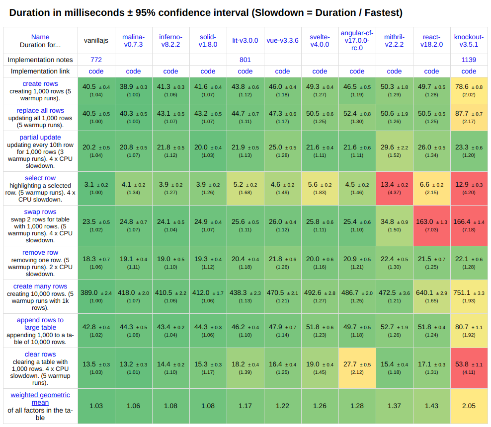
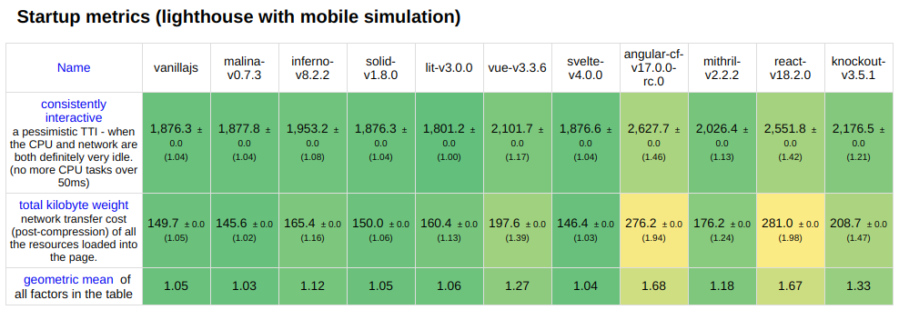

# Malina.js


Malina.js helps you create a fast and thin web application that runs **without a front-end framework**
* High performance, [look at benchmark](#benchmark)
* One of the best in [startup metrics](#startupmetrics)
* Compact bundle size of an app (starts from 185 bytes), [TodoMVC example](https://malina-todomvc.surge.sh) **2.7kb** (gzipped) [source code](https://github.com/malinajs/todomvc)
* Familiar syntax based of standard HTML, CSS and JavaScript

### Links

* **[Try Malina.js online (REPL)](https://malinajs.github.io/repl/)**
* [Documentation](https://malinajs.github.io/docs/)
* [Telegram community](https://t.me/malinajs)
* [Syntax Highlighter for VS-Code](https://marketplace.visualstudio.com/items?itemName=AlexxNB.malina-js-highlight)

### Benchmark
<a id="benchmark"></a>


### Startup metrics
<a id="startupmetrics"></a>


### Articles

* [Comparision with Svelte.js](https://medium.com/@lega911/svelte-js-and-malina-js-b33c55253271)
* [Comparision with Vue 3](https://medium.com/@lega911/vue-3-vs-malina-js-abd97025ba81)
* [Passing CSS classes to child components](https://medium.com/@lega911/how-a-popular-feature-declined-by-svelte-went-live-in-malina-js-1a08fdb9dbc4)
* [Using fragments](https://medium.com/@lega911/how-fragments-can-help-in-your-web-development-5efc4d10f9da)

## Example

```html
<script>
  let name = 'world';
    
  function rename() {
    name = 'user';
  }
</script>

<h1>Hello {name.toUpperCase()}!</h1>
<button @click={rename}>Rename</button>
```

## Quick Start

You can get started with a simple app by running the following in your terminal:
```
npm create malina myapp
cd myapp
npm run dev
# open http://localhost:7000/
```

## License

[MIT](LICENSE)
